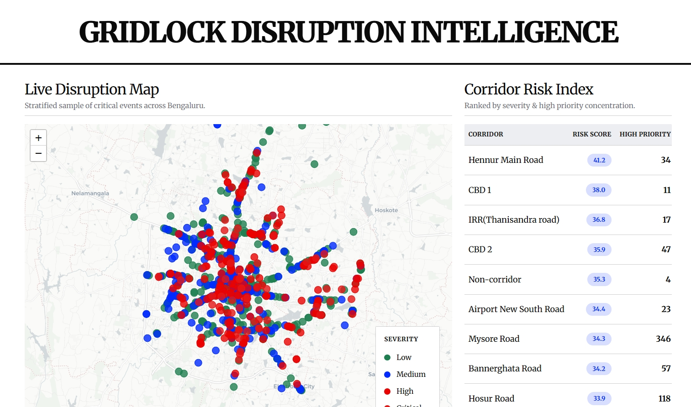
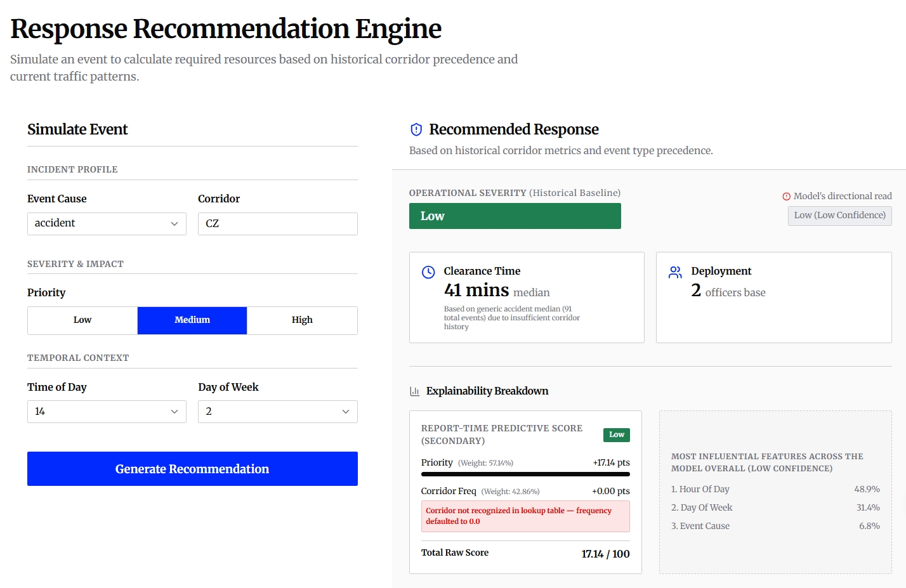
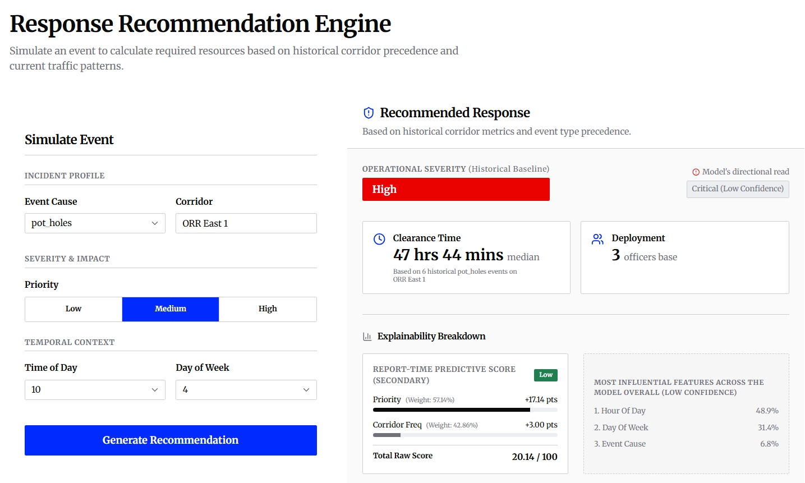
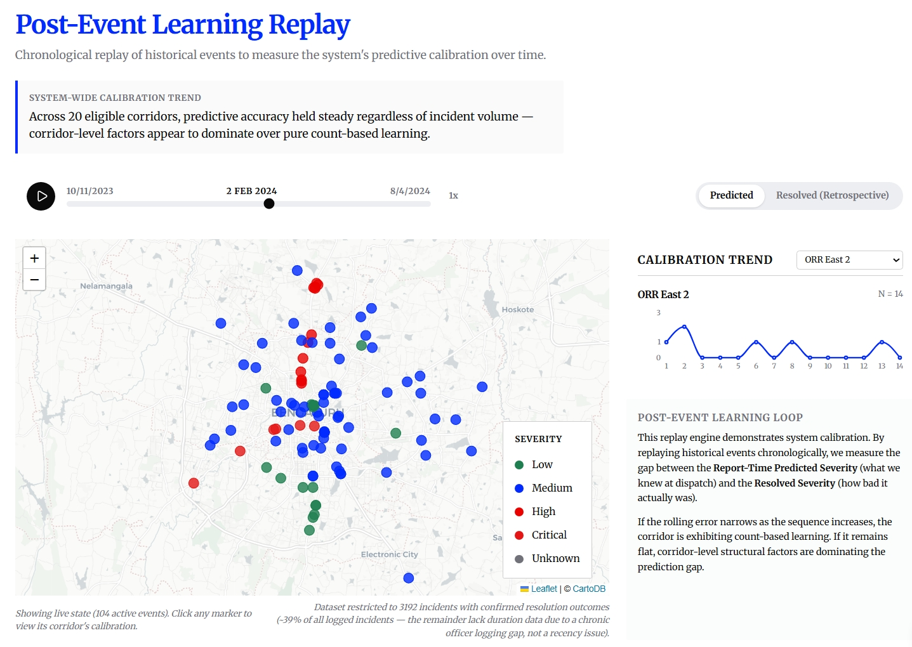
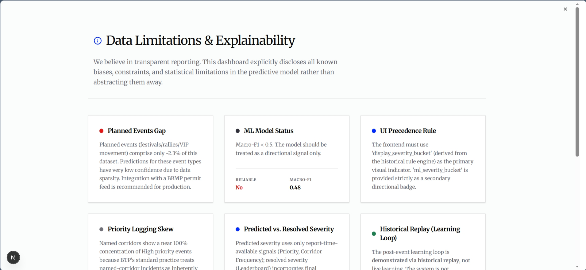
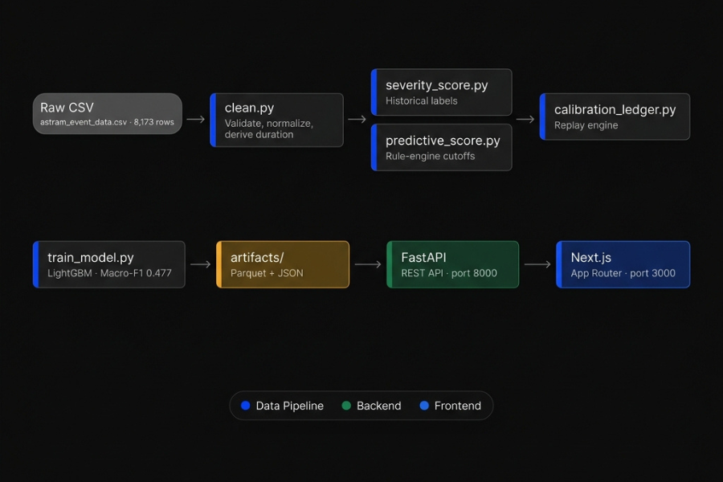

**Gridlock Hackathon 2.0 — Theme 2 (Event-Driven Congestion) · Target: Bengaluru Traffic Police (BTP) & Flipkart**

This system forecasts the congestion impact of event-driven disruptions and recommends proportional officer deployment. Built on 8,173 real-world BTP incident records — no synthetic data.

> See [METHODOLOGY.md](METHODOLOGY.md) and [FEATURE_AVAILABILITY.md](FEATURE_AVAILABILITY.md) for the full data audit, scoring logic, and statistical disclosures.

**[🌐 Live App](https://gridlock-disruption-intelligence.vercel.app/) · [📹 Demo Video](https://drive.google.com/file/d/11pon8lB-GCGtmyYGC9p9g0xwiS3cPIua/view?usp=drive_link) · [💻 GitHub](https://github.com/sujeetgund/gridlock-disruption-intelligence)**

---

## What It Does

| Feature | Description |
|---|---|
| **Live Disruption Map** | Stratified sample of historical incidents across Bengaluru, color-coded by severity |
| **Response Recommendation Engine** | Rule-based prediction using only report-time data (Priority + Corridor Frequency) — no post-resolution leakage |
| **Post-Event Learning Replay** | Chronological calibration replay showing predicted vs. resolved severity gap over time |
| **Explainability Panel** | Per-prediction breakdown of score components; flags corridor fallback inline if lookup misses |
| **Data Limitations Drawer** | Full-screen disclosure of model constraints, logging gaps, and ML confidence |

## Three-Signal Architecture

The system produces three independent severity reads per incident, never blended:

1. **Historical Baseline** (`display_severity_bucket`) — retrospective, based on actual median clearance time for the cause+corridor combination.
2. **Report-Time Predictive Score** — deterministic rule engine (Priority 57.14% + Corridor Frequency 42.86%), computable at the moment of logging.
3. **ML Directional Read** (`ml_severity_bucket`) — LightGBM classifier on 6 report-time features; labeled low-confidence and secondary.

## Known Limitations

* **Coarse Bucket Resolution:** 4-bucket output (Low/Medium/High/Critical) built on 2 input signals only, to strictly avoid label leakage.
* **Low ML Confidence:** Macro-F1 of 0.477 on held-out test split. Kept explicitly secondary to the rule engine.
* **Chronic Logging Gaps:** ~61% of records lack completion timestamps — only ~39% of events have a resolvable duration for ground-truth labeling.

*See [METHODOLOGY.md](METHODOLOGY.md) for full statistical detail.*

## Screenshots

<table>
  <tr>
    <td align="center" width="50%">
      
      <br /><sub><b>Explainability Panel & Fallback Disclosure</b><br />Inline warning when corridor lookup misses — prevents silent zero</sub>
    </td>
    <td align="center" width="50%">
      
      <br /><sub><b>Three-Signal Architecture Panel</b><br />Historical Baseline · Rule-Based Predictive · ML Directional Read</sub>
    </td>
  </tr>
  <tr>
    <td align="center" width="50%">
      
      <br /><sub><b>Post-Event Learning Replay</b><br />Predicted vs. resolved severity gap plotted chronologically</sub>
    </td>
    <td align="center" width="50%">
      
      <br /><sub><b>Data Limitations & Disclosures</b><br />Full-screen disclosure of model constraints and logging gaps</sub>
    </td>
  </tr>
</table>

Dataset: [`data/astram_event_data.csv`](data/astram_event_data.csv) — 8,173 real-world BTP incident records. No synthetic or simulated rows in the training or calibration pipeline.

## Data Pipeline & Artifacts

<!-- ARCHITECTURE DIAGRAM:
Data Pipeline (run in order from project/data-pipeline/):
  1. clean.py          — Validates, normalizes raw CSV, derives duration fields → cleaned_data.parquet
  2. severity_score.py — Computes historical severity bucket from clearance time → scored_data.parquet, corridor_lookup.json
  3. predictive_score.py — Builds rule-engine cutoffs from report-time features only → predictive_cutoffs.json, predicted_data.parquet
  4. calibration_ledger.py — Replays incidents chronologically to compute predicted vs resolved error → calibration_ledger.parquet, calibration_summary.json
  5. train_model.py    — Trains LightGBM on 6 report-time features, no leakage → model.pkl, feature_importance.json, model_confidence.json
  6. validate.py       — Gate check on all artifacts before serving
All outputs go to: data-pipeline/artifacts/
Backend: FastAPI (port 8000) loads artifacts at startup, serves /api/predict, /api/events, /api/calibration
Frontend: Next.js 16 App Router (port 3000) proxies /api to FastAPI
-->

<div style="display: flex; justify-content: center;">

</div>

To run the pipeline from scratch:
```bash
cd project/data-pipeline
uv run python clean.py
uv run python severity_score.py
uv run python predictive_score.py
uv run python calibration_ledger.py
uv run python train_model.py
uv run python validate.py
```

Key artifacts generated:
- `cleaned_data.parquet` — standardized historical ledger
- `predictive_cutoffs.json` — corridor frequencies and rule-engine thresholds
- `model.pkl` — trained LightGBM model
- `calibration_ledger.json` & `calibration_summary.json` — Timeline Replay data

## Setup

### Backend

```bash
cd project
uv sync          # install all Python dependencies
uv run uvicorn backend.main:app --port 8000
```

### Frontend

```bash
cd project/frontend
pnpm install
pnpm run dev
```

### Environment Variables

The Next.js frontend proxies `/api` to `http://127.0.0.1:8000` by default. To point at a remote backend:

```env
# .env.local
BACKEND_URL=https://your-backend-url.com
```

## Deploying the Backend (Google Cloud Run)

The backend is fully containerized.

```bash
# 1. Authenticate and set your project
gcloud auth login
gcloud config set project YOUR_PROJECT_ID

# 2. Build and deploy in one step (Cloud Build handles the Docker build)
gcloud run deploy gridlock-backend \
  --source . \
  --region asia-south1 \
  --platform managed \
  --allow-unauthenticated \
  --port 8080 \
  --memory 1Gi \
  --cpu 1

# 3. Copy the deployed URL and set it in frontend/.env.local
echo "BACKEND_URL=https://<your-service-url>.run.app" > frontend/.env.local
```

> [!NOTE] 
> The image is ~500MB — `lightgbm` and `pandas` are the heavy dependencies. `--memory 1Gi` is the minimum safe value for loading the model and parquet artifacts at startup.

